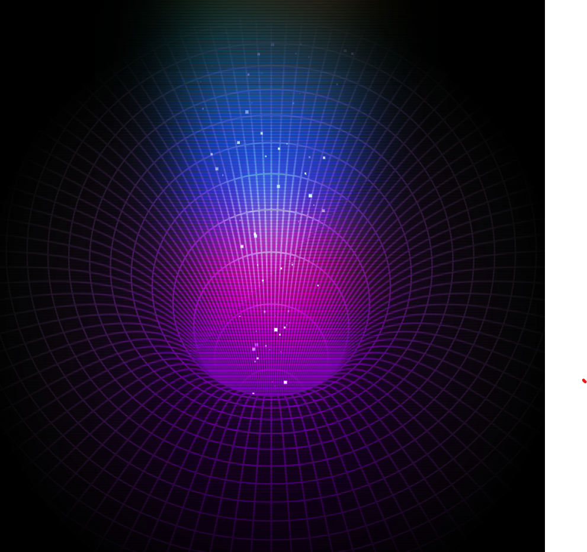

# Black Hole Criativo

Um projeto web inovador que exibe uma animação interativa e visualmente impressionante de um “buraco negro” utilizando Web Components, canvas 2D e técnicas avançadas de animação com easing.

## Descrição

Este projeto cria um componente customizado `<a-hole>` que representa um buraco negro animado, combinando vários elementos gráficos:

- Discos elípticos que se contraem;
- Linhas radiais animadas;
- Partículas com movimento fluido;
- Sobreposição de efeitos visuais com gradientes e blur.

A animação é gerada dinamicamente usando a API Canvas 2D, combinada com easing para suavizar os movimentos.

---

## Tecnologias Utilizadas

- HTML5 com Web Components (Custom Elements)
- JavaScript moderno (ES6 modules)
- Canvas API 2D para desenho gráfico
- CSS3 avançado com gradientes, animações e mix-blend-mode
- Biblioteca externa para easing: [easing-utils](https://esm.sh/easing-utils)
- Servidor HTTP local para evitar problemas CORS

bash
Copiar
Editar
npm install -g http-server
Passo 4 — Rodar o servidor local
Na pasta raiz do projeto, execute:

bash
Copiar
Editar
http-server
Por padrão, o servidor rodará no endereço:

arduino
Copiar
Editar
http://localhost:8080
Caso a porta esteja ocupada, o http-server indicará uma porta alternativa.

Passo 5 — Acessar o projeto no navegador
Abra o navegador e acesse:

arduino
Copiar
Editar
http://localhost:8080
A animação do buraco negro começará automaticamente.

Passo 6 — Explorar e testar
Verifique o console do navegador (F12 > Console) para garantir que não há erros.

Ajuste o tamanho da janela para testar responsividade do componente <a-hole>.

Contribuições
Contribuições são bem-vindas! Para colaborar:

Abra uma issue para reportar bugs ou sugerir melhorias.

Faça um fork e envie pull requests com novas funcionalidades ou correções.

Sugestões para suporte a navegadores ou novas animações serão valorizadas.

Licença
Este projeto é licenciado sob a MIT License.

Visualização do Projeto
Veja abaixo uma captura de tela da animação rodando:

Desenvolvido por Fernando
